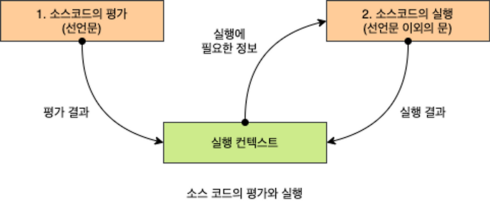
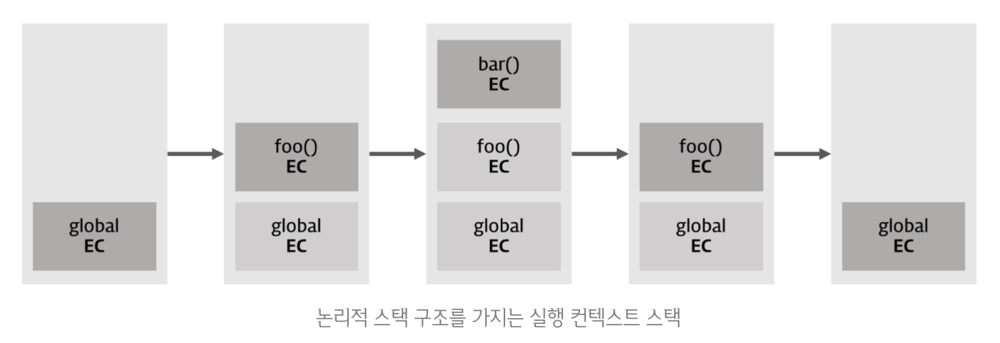

# 21장 빌트인 객체

자바스크립트의 3가지 객체

1. 표준 빌트인 객체
   - ECMAScript에 정의된 객체이며, 애플리케이션 전역의 공통 기능을 제공한다.
   - 자바스크립트 실행 환경과 관계없이 언제나 사용할 수 있다.
2. 호스트 객체
   - ECMAScript에 정의되어 있지 않고, 자바스크립트 실행 환경에서 추가로 제공하는 객체
   - `브라우저 환경` -> 클라이언트 사이드 Web API
   - `Node.js 환경` -> Node.js 고유의 API
3. 사용자 정의 객체
   - 제공된 객체가 아닌 사용자가 정의한 객체

#### 1️⃣ 표준 빌트인 객체

`Math`, `Reflect`, `JSON` 을 제외한 표준 빌트인 객체는 모두 인스턴스를 생성할 수 있는 생성자 함수 객체다.

- 생성자 함수 객체

  - `프로토타입 메서드` + `정적 메서드` 제공
  - 정적 메서드는 인스턴스 없이 정적으로 호출할 수 있다.

- 생성자 함수가 아닌 객체
  - `정적 메서드`만 제공

#### 2️⃣ 원시 값과 래퍼 객체

문자열, 숫자, 불리언은 원시 값임에도 표준 빌트인 생성자 함수(String, Number, Boolean)가 존재하는 이유는?

- 원시 값을 객체처럼 사용하면, 자바스크립트 엔진이 암묵적으로 연관된 객체를 생성하고 접근한 후, 다시 원시값으로 되돌린다.
- 이렇게 생성되는 임시 객체를 `래퍼 객체`라고 한다. (wrapper object)
- `심벌`도 래퍼 객체를 생성하지만, 리터럴 표기법으로 생성할 수 없고 Symbol 함수로 생성해야 한다.
- 다른 원시 값인 `null`, `undefined`는 래퍼 객체를 생성하지 않는다.

따라서 래퍼 객체로 인해, 표준 빌트인 객체인 `String`, `Number`, `Boolean`, `Symbol`의 프로토타입 메서드나 프로퍼티를 참조할 수 있다.

```js
const str = 'hi';

// 1. 래퍼 객체 변환
// 식별자 str은 래퍼 객체인 String 인스턴스로 변환되고, 래퍼 객체의 [[StringData]] 내부 슬롯에 할당된다.
console.log(str.length); // 2
console.log(str.upperCase()); // HI

// 2. 래퍼 객체 처리 종료
// 래퍼 객체로 프로퍼티에 접근하거나 메서드를 호출한 후, 다시 원시값으로 되돌린다
// 래퍼 객체는 가비지 컬렉션의 대상이 된다.
console.log(typeof str); // string
```

```js
const str = 'hello';
str.name = 'Lee';
console.log(str.name); // undefined
```

#### 3️⃣ 전역 객체

코드가 실행되기 전에, 자바스크립트 엔진에 의해 어떤 객체보다도 가장 먼저 생성되는 특수한 객체이며 어떤 객체에도 속하지 않은 최상위 객체다.

1. 개발자가 의도적으로 생성할 수 없다 -> 전역 객체를 생성할 수 있는 생성자 함수가 없음
2. 브라우저 환경 -> `window` / Node.js 환경 -> `global`
3. 전역 객체의 프로퍼티를 참조할 때 window, global 생략 가능
4. 전역 객체의 프로퍼티는 `표준 빌트인 객체 + 환경에 따른 호스트 객체 + var 키워드로 선언한 전역 변수와 전역 함수`
5. let, const 키워드로 선언한 전역 변수는 전역 객체의 프로퍼티가 아니다. -> 접근 불가능
6. 브라우저 환경의 모든 자바스크립트 코드는 하나의 전역 객체 `window`를 공유한다.

### 전역 객체의 프로퍼티 & 메서드

#### 프로퍼티

- `Infinity`
- `NaN`
- `undefined`

#### 메서드

- `eval(string)`
  - 기존의 스코프를 런타임에 동적으로 수정한다.
  - 표현식: 런타임에 평가해서 값을 생성
  - 표현식이 아닌 문: 런타임에 실행
- `isFinite(number)`
  - 유한수 -> true
  - 무한수 or NaN -> false
- `isNaN`
  - `isNaN(undefined)` -> true
- `parseFloat`
  - 전달받은 문자열 인수를 실수로 해석해서 반환
- `parseInt`
  - 전달받은 문자열 인수를 정수로 해석해서 반환
  - 두번째 인수로 진법(2~36)을 나타내는 기수로 전달할 수 있다.
- `encodeURI / decodeURI`
- `encodeURIComponent / decodeURIComponent`

```js
parseInt('10', 2); // 2
parseInt('10.123'); // 10
parseInt('0xf'); // 16진수로 해석해서 10진수로 반환한다
parseInt('0b10'); // 2진수, 8진수는 해석하지 못한다
parseInt('34 45 66'); // 공백으로 구분된 문자열은 첫 번째 문자열만 반환한다
parseInt('40 years'); // 40
parseInt('He was 40'); // 첫 번째 문자열로 숫자로 변환할 수 없으면 NaN을 반환한다
```

#### 암묵적 전역

```js
console.log(x); // undefined
console.log(y); // ReferenceError: y is not undefined

var x = 10; // 전역 변수

function foo() {
  // 선언하지 않은 식별자에 값을 할당
  y = 20; // window.y = 20;
}
foo();

// 선언하지 않은 식별자 y를 전역에서 참조할 수 있다.
// 전역 객체의 프로퍼티가 되기 때문
console.log(x + y); // 30
```

<br/>
<br/>

# 22장 this

### this 키워드

객체의 동작을 나타내는 `메서드`는 자신이 속한 객체의 프로퍼티를 참조할 수 있어야 한다.

- 재귀적으로 참조할 수 있지만, 옳지 않은 방법
- 생성자 함수를 정의하기 전에 생성자 함수가 생성할 인스턴스를 가리키는 식별자를 알 수 없는데
- 이 때, this라는 특수한 식별자를 제공한다.
- 자바스크립트 엔진에 의해 암묵적으로 생성되며, 코드 어디서든 참조할 수 있다.
- 자바나 C++ 같은 클래스 기반 언어에서 this는 언제나 클래스가 생성하는 인스턴스를 가리킨다.
- 하지만 자바스크립트의 this는 함수 호출 방식에 의해 this에 바인딩될 값이 동적으로 결정된다.

this는 상황에 따라 가리키는 대상이 다르다.

- `전역 & 일반 함수 내부`: 전역 객체 window
- `메서드 내부`: 메서드를 호출한 객체
- `생성자 함수 내부`: 생성자 함수가 생성할 인스턴스

### 함수 호출 방식과 this 바인딩

this 바인딩은 함수 호출 시점에 결정된다. 함수를 호출하는 방식은 다음과 같다.

1. 일반 함수 호출
   - 전역 객체
2. 메서드 호출
   - 메서드를 호출한 객체
3. 생성자 함수 호출
   - 생성자 함수가 생성할 인스턴스
4. `Function.prototype.apply / call / bind` 메서드에 의한 간접 호출
   - 첫 번째 인수로 전달한 객체

#### 1️⃣ 일반 함수 호출

기본적으로 this에는 전역 객체가 바인딩된다.

- 전역 함수는 물론, 중첩 함수를 일반 함수로 호출하면 함수 내부의 this에는 전역 객체가 바인딩된다.
- 단, strict mode 에서 this를 참조할 경우는 `undefined`가 바인딩
- 중첩 함수나 콜백 함수의 경우, 용도가 일반적으로 외부 함수를 돕는 헬퍼 함수의 역할을 하므로, this가 가리키는 객체가 전역 객체일 경우 헬퍼 함수의 역할을 하기 어렵다.
- 메서드 내부의 중첩 함수가 콜백 함수의 this 바인딩을 메서드 this 바인딩과 일치시키기 위한 방법은 다음과 같다.

```js
// 전역 변수 value ( 전역 객체 프로퍼티 )
var value = 1;

const obj = {
  value: 100,
  foo() {
    // 콜백 함수에 바인딩할 obj 객체를 가리키는 this를 변수 that에 할당
    const that = this;

    setTimeout(function () {
      console.log(`callback 함수의 this : ${that}`); // callback 함수의 this : [object Object]
      console.log(
        `callback 함수의 this가 가리키는 객체의 value : ${that.value}`
      ); // callback 함수의 this가 가리키는 객체의 value : 100
    }, 100);
  },
};

obj.foo();
```

#### 2️⃣ 메서드 호출

메서드 내부의 this는 메서드를 소유한 객체가 아닌, 메서드르 호출한 객체에 바인딩된다.

- 메서드를 호출할 때, 메서드 앞에 마침표 연산자 앞에 기술한 객체가 바인딩
- 메서드는 객체에 포함된 것이 아니라, 독립적으로 존재하는 별도의 객체다.
- 즉, 다른 객체의 프로퍼티에 할당이 가능하다.

```js
const person = {
  name: 'Lee',
  getName() {
    return this.name;
  },
};

const anotherPerson = {
  name: 'Kim',
};

// getName 메서드를 anotherPerson 객체의 메서드로 할당
anotherPerson.getName = person.getName;

// getName을 호출한 객체는 person이 아닌 anotherPerson이다.
console.log(anotherPerson.getName()); // Kim

// getName 메서드를 변수에 할당
const getName = person.getName;

// getName 메서드를 일반 함수로 호출
// 브라우저 환경: ''
// Node.js: undefined
console.log(getName());
```

#### 3️⃣ 생성자 함수 호출

생성자 함수 내부의 this에는 생성자 함수가 생성할 인스턴스가 바인딩된다.

- 생성자 함수는 객체를 생성하는 함수다

```js
// 생성자 함수
function Circle(radius) {
  this.radius = radius;
  this.getDiameter = function () {
    return 2 * this.radius;
  };
}

const circle1 = new Circle(5);
const circle2 = new Circle(10);

console.log(circle1.getDiameter()); // 10
console.log(circle2.getDiameter()); // 20

const circle3 = Circle(15); // 일반 함수 호출
console.log(circle3); // undefined
console.log(radius); // 전역 객체, 15
```

#### 4️⃣ `Function.prototype.apply/call/bind` 메서드에 의한 간접 호출

Function.prototype의 메서드다.

- `Function.prototype.apply(this로 사용할 객체, arguments 리스트(배열 or 유사배열객체))`
- `Function.prototype.call(this로 사용할 객체, arguments 인수 리스트(,로 구분하여 전달))`
- `Function.prototype.bind(this로 사용할 객체)`

apply, call 메서드의 본질적인 기능은 함수를 호출하는 것이다.

- 함수를 호출하면서 첫 번째 인수로 전달한 특정 객체를 호출한 함수의 this에 바인딩한다.
- 두 번 째 인수를 전달하는 방식만 다를 뿐 동일하게 작동한다.
- arguments 객체와 같은 유사 배열 객체에 배열 메서드를 사용하는 경우에 효과적이다.
- arguments 객체는 배열이 아니기 때문에 Array.prototype.slice 같은 배열의 메서드를 사용할 수 없으나 이 메서드를 사용하면 가능하다.

```js
function convertArgsToArray() {
  console.log(arguments); // [Arguments] { '0': 1, '1': 2, '2': 3 }

  // Array.prototype.slice를 인수 없이 호출하면 배열의 복사본을 생성한다.
  const arr = Array.prototype.slice.call(arguments);

  console.log(arr); // [ 1, 2, 3 ]

  return arr;
}

convertArgsToArray(1, 2, 3); // [1, 2, 3]
```

bind 메서드는 함수를 호출하지 않는다.

- 첫 번째 인수로 전달한 값으로 this 바인딩이 교체된 함수를 새롭게 생성해 반환한다.
- this와 메서드 내부의 중첩 함수 or 콜백 함수의 this가 불일치하는 문제를 해결하는데 효과적이다.

```js
function getThisBinding() {
  return this;
}

// this로 사용할 객체
const thisArg = { a: 1 };

console.log(getThisBinding.bind(thisArg)); // getThisBinding

// bind는 함수를 호출하지 않으므로 명시적으로 호출해야 한다.
console.log(getThisBinding.bind(thisArg)()); // {a:1}
```

```js
const person = {
  name: 'Lee',
  foo(callback) {
    // bind를 적용하지 않으면, foo 메서드 내부에 콜백 함수로 정의된 this는 전역 객체
    setTimeout(callback.bind(this), 100);
  },
};

person.foo(function () {
  console.log(`Hi, my name is ${this.name}`); // Hi, my name is Lee
});
```

<br/>
<br/>

# 23장 실행 컨텍스트 (Execution Context)

> 실행 컨텍스는 자바스크립트 코드의 동작 원리를 담고 있는 핵심 개념이다.

### 소스 코드의 타입

실행 가능한 코드(소스코드)를 4가지로 나눈 이유는, 소스코드의 타입에 따라 실행 컨텍스트를 생성하는 과정과 관리 내용이 다르기 때문이다.

1. 전역 코드
   - 전역에 존재하는 소스코드
   - 전역에 정의된 함수, 클래스 등의 내부 코드는 포함되지 않는다.
2. 함수 코드
   - 함수 내부에 존재하는 소스코드
   - 함수 내부에 중첩된 함수, 클래스 등의 내부 코드는 포함되지 않는다.
3. eval 코드
   - eval 함수에 인수로 전달되어 시행되는 소스코드
4. 모듈 코드
   - 모듈 내부에 존재하는 소스코드
   - 모듈 내부의 함수, 클래스 등의 내부 코드는 포함되지 않는다.

### 소스 코드의 평가와 실행

자바스크립트 엔진은 소스코드를 2개의 과정으로 나눠 처리한다.

1. 소스코드 평가 과정

   - 실행 컨텍스트를 생성
   - 변수, 함수 등의 선언문만 먼저 실행해서 생성된 변수나 함수 식별자를 키로, 실행 컨텍스트가 관리하는 스코프(렉시컬 환경의 환경 레코드)에 등록한다.

2. 소스코드 실행 과정

   - 선언문을 제외한 소스토드가 순차적으로 실행 (런타임)
   - 소스코드 실행에 필요한 정보를 실행 컨텍스트가 관리하는 스코프에서 검색해서 취득
   - 변수 값의 변경 등 소스코드의 실행 결과는 다시 실행 컨텍스트가 관리하는 스코프에 등록된다.



### 실행 컨텍스트 역할

실행 컨텍스트는 `식별자를 등록하고 관리하는 스코프`와 `코드 실행 순서 관리`를 구현한 내부 메커니즘,

모든 코드는 실행 컨텍스트를 통해 실행되고 관리된다.

실행 컨텍스트가 관리하는 내용

1.  선언에 의해 생성된 모든 식별자를 스코프를 구분하여 등록하고, 상태 변화를 지속적으로 관리
2.  스코프는 중첩 관계에 의해 스코프 체인을 생성 -> 스코프 체인을 통해 상위 스코프로 이동하며 식별자를 검색
3.  현재 실행 중인 코드의 실행 순서를 변경할 수 있어야 하고, 다시 돌아갈 수 있어야 한다

### 실행 컨택스트 스택

> 코드의 실행 순서를 관리한다.

실행 컨텍스트 스택의 최상위에 존재하는 실행 컨텍스트는 언제나 현재 실행 중인 코드의 실행 컨텍스트다.

-> 최상위에 존재하는 실행 컨텍스트 = 실행 중인 실행 컨텍스트

```js
const x = 1;
function foo() {
  const y = 2;

  function bar() {
    const z = 3;
    console.log(x + y + z);
  }
  bar();
}

foo(); // 6
```

실행 순서:

1. 전역 코드의 평가와 실행
2. foo 함수 코드의 평가와 실행
3. bar 함수 코드의 평가와 실행
4. bar 함수 코드 실행 종료 -> foo 함수 코드로 복귀
5. foo 함수 코드 실행 종료 -> 전역 코드로 복귀
6. 전역 코드 실행 종료



### 렉시컬 환경

> 식별자와 스코프를 관리한다.

식별자와 식별자에 바인딩된 값, 그리고 상위 스포크에 대한 참조를 기록하는 자료구조로 실행 컨텍스트를 구성하는 컴포넌트다.

렉시컬 환경은 다음과 같이 2개의 컴포넌트로 구성된다.

1. `환경 레코드 (Environment Record)`

   - 스코프에 포함된 식별자를 등록하고 등록된 식별자에 바인딩된 값을 관리하는 저장소다.

2. `외부 렉시컬 환경에 대한 참조 (Outer Lexical Environment Reference)`

   - 상위 스코프를 가리킨다.
   - 이를 통해 단방향 링크드 리스트인 스코프 체인을 구현한다.

### 실행 컨텍스트 생성과 식별자 검색 과정

```js
const x = 1;
const y = 2;

function foo(a) {
  var x = 3;
  const y = 4;

  function bar(b) {
    const z = 5;
    console.log(a + b + x + y + z);
  }
  bar(10);
}

foo(20); // 42
```

1. 전역 객체 생성

2. 전역 코드 평가

3. 전역 코드 실행

4. foo 함수 코드 평가 -> foo 함수 코드 실행

5. bar 함수 코드 평가 -> bar 함수 코드 실행

6. bar 함수 코드 실행 종료

7. foo 함수 코드 실행 종료

8. 전역 코드 실행 종료

### 실행 컨텍스트와 블록 레벨 스코프

var 키워드로 선언한 변수는 오로지 함수의 코드 블록만 지역 스코프로 인정하는 함수 레벨 스코프를 따른다.

하지만, let const 키워드로 선언한 변수는 모든 코드 블록을 지역 스코프로 인정하는 블록 레벨 스코프를 따른다.

```js
let x = 1;

if (true) {
  let x = 10;
  console.log(x); // 10
}

console.log(x); // 1
```

- 블록 레벨 스코프를 생성하는 블록문은 새로운 렉시컬 환경을 생성한다.
- 블록문이 종료되면, 이전의 렉시컬 환경으로 되돌린다.

<br/>
<br/>

# 24장 클로저

> 클로저는 함수와 그 함수가 선언된 렉시컬 환경과의 조합이다.

### 렉시컬 스코프

`렉시컬 스코프(정적 스코프)`는 함수를 어디서 호출했는지가 아니라, `어디에 정의했는지`에 따라 상위 스코프를 결정하는 것이다.

```js
const x = 1;

function foo() {
  const x = 10;
  bar();
}

function bar() {
  console.log(x);
}

foo(); // 1
bar(); // 1
```

- bar 함수는 전역에서 정의되었기 때문에, 전역 스코프를 상위 스코프로 가진다.
- 따라서 bar 함수 내부에서 x 변수를 참조할 때, 전역 변수 x를 참조한다.
- 이처럼 함수의 상위 스코프는 함수를 정의한 위치에 의해 정적으로 결정되고 변하지 않는다.

"함수의 상위 스코프를 결정한다" = "렉시컬 환경의 `외부 렉시컬 환경에 대한 참조`에 저장할 참조값을 결정한다"

### 함수 객체의 내부 슬롯 [[Environment]]

함수는 자신의 내부 슬롯 `[[Environment]]`에 자신이 정의된 환경, 즉 상위 스코프의 참조를 저장한다.

- 함수 객체의 내부 슬롯 `[[Environment]]`에 저장된 현재 실행 중인 실행 컨텍스트의 렉시컬 환경의 잠조가 바로 상위 스코프다.
- 또한, 자신이 호출되었을 때 생성될 함수 렉시컬 환경의 "와부 렉시컬 환경에 대한 참조"에 저장될 참조값이다.
- 함수 객체는 내부 슬롯 `[[Environment]]`에 저장한 렉시컬 환경의 참조, 즉 상위 스코프를 자신이 존재하는 한 기억한다.

### 클로저와 렉시컬 환경

외부 함수보다 중첩 함수가 더 오래 유지되는 경우, 중첩 함수는 이미 생명 주기가 종료한 외부 함수의 변수를 참조할 수 있다.

이러한 중첩 함수를 `클로저(closure)`라고 부른다.

**클로저는 중첩 함수가 상위 스코프의 식별자를 참조하고 있고, 중첩 함수가 외부 함수보다 더 오래 유지되는 경우에 한정하는 것이 일반적이다.**

- 상위 스코프의 어떤 식별자도 참조하지 않는 함수는 클로저가 아니다.

```js
const x = 1;

// 1
function outer() {
  const x = 10;
  const inner = function () {
    // 2
    console.log(x);
  };

  return inner;
}

// outer 함수를 호풀하면 중첩 합수 inner 를 반환한다.
// 그리고 outer 함수의 실행 컨텍스트는 실행 컨텍스트 스택에서 팝되어 제거된다.
const innerFunc = outer(); // 3
innerFunc(); // 4
```

### 클로저의 활용

클로저는 상태를 안전하게 변경하고 유지하기 위해 사용한다.

- 변수 값은 누군가에 의해 언제든지 변경될 수 있어 오류 발생의 근본적 원인이 될 수 있다.
- 따라서, 클로저는 상태를 안전하게 은닉(inforamtion hiding)하고 특정 함수에게만 상태 변경을 허용하기 위해 적극적으로 사용된다.

```js
const increase = (function () {
  let num = 0;

  // 클로저
  return function () {
    // 카운트 상태를 1만큼 증가시킨다.
    return ++num;
  };
})();

console.log(increase()); // 1
console.log(increase()); // 2
console.log(increase()); // 3
```

- 즉시 실행 함수는 호출 이후 소멸되지만, 즉시 실행 함수가 반환한 클로저는 increase 변수에 할당되어 호출된다.
- 따라서, 즉시 실행 함수가 반환한 클로저는 카운트 상태를 유지하기 위한 자유 변수 num을 언제 어디서 호출하든지 참조하고 변경할 수 있다.

### 캡슐화와 정보 은닉

- `캡슐화`
  - 객채의 상태를 나타내는 프로퍼티와 프로퍼티를 참조하고 조작할 수 있는 동작인 메서드를 하나로 묶는 것
- `정보 은닉`
  - 캡슐화는 객체의 특정 프로퍼티나 메서드를 감출 목적으로 사용
- 자바스크립트는 접근 제한자를 제공하지 않지만, 클로저를 사용하면 정보 은닉이 가능하다.

```js
function Person(name, age) {
  this.name = name; // public
  let _age = age; // private

  // 인스턴스 메서드
  this.sayHi = function () {
    console.log(`Hi! My name is ${this.name}. I am ${_age}.`);
  };
}

const me = new Person('Lee', 20);
me.sayHi(); // Hi! My name is Lee. I am 20.
console.log(me.name); // Lee
console.log(me._age); // undefined

const you = new Person('Kim', 30);
you.sayHi(); // Hi! My name is Kim. I am 30.
console.log(you.name); // Kim
console.log(you._age); // undefined
```

### 자주 발생하는 실수

```js
var funcs = [];

for (var i = 0; i < 3; i++) {
  funcs[i] = function () {
    return i;
  }; // 1
}

for (var j = 0; j < funcs.length; j++) {
  console.log(funcs[j]()); // 2
}
```

- 배열 funcs의 요소로 추가된 3개의 함수가 0, 1, 2를 반환할 것 같지만, 결과는 3, 3, 3을 출력한다.
- var 키워드로 선언한 변수가 함수 레벨 스코프를 갖기 때문이다.

해결 방법은 다음과 같다.

1. let 키워드 사용
2. 고차 함수 사용

<br/>
<br/>

# 25장 클래스

> 클래스는 객체를 생성하기 위한 템플릿으로, 객체가 가져야 할 상태와 동작을 정의한다.

### 클래스는 프로토타입의 문법적 설탕일까?

ES6에 도입된 클래스는 기존 프로토타입 기반 프로그래밍보다 자바나 C# 같은 클래스 기반 객체지향 프로그래밍에 익숙한 프로그래머가
더욱 빠르게 학습할 수 있도록 클래스 기반 객체지향 프로그래밍 언어와 매우 흡사한 새로운 객체 생성 메커니즘을 제시한다.

클래스는 생성자 함수와 유사하게 동작하지만 다음과 같은 차이가 있다.

1. new 연산자 없이 호출하면 에러가 발생한다.
2. 상속을 지원하는 extends와 super 키워드를 제공한다.
3. 호이스팅이 발생하지 않는 것처럼 동작한다.
4. 클랴스 내의 모든 코드에는 암묵적으로 strict mode가 지정되어 실행되며 해제할 수 없다.
5. 클래스의 constructor, 프로토타입 메서드, 정적 메서드는 모두 프로퍼티 어트리뷰트 [[Enumerable]]의 값이 false다.

### 클래스 정의

> 클래스는 class 키워드를 사용하여 정의한다.

```js
// 클래스 선언문
class Person {}

// 클래스 표현식
const Person = class {};
```

- `클래스는 값처럼 사용할 수 있는 일급 객체다.`
- 무명의 리터럴로 생성할 수 있다. 즉, 런타임에 생성이 가능하다.
- 변수나 자료구조에 저장할 수 있다.
- 함수의 매개변수에게 전달할 수 있다.
- 함수의 반환값으로 사용할 수 있다.

### 클래스 호이스팅

> 클래스는 함수로 평가된다.

```js
class Person {}

console.log(typeof Person); // function
```

- 클래스는 let, const 키워드로 선언한 변수처럼 호이스팅된다.
- 따라서, 클래스 선언문 이전에 클래스를 참조하면 `참조 에러(ReferenceError)`가 발생한다.

### 인스턴스 생성

> 클래스는 생성자 함수이며, new 연산자와 함께 호출되어 인스턴스를 생성한다.

```js
class Person {}

const me = new Person();
console.log(me); // Person {}

const you = new Person(); // TypeError
```

- 클래스는 인스턴스를 생성하는 것이 유일한 존재 이유이기 때문에, 반드시 new 연산와 함께 호출해야 한다.

### 메서드

> 클래스 몸체에는 0개 이상의 메서드만 선언할 수 있다.

#### 1️⃣ constructor

- 인스턴스를 생성하고 초기화하기 위한 특수한 메서드
- constructor는 클래스 내에 최대 한 개만 존재할 수 있다
- constructor 내부의 this는 생성자 함수와 마찬가지로 클래스가 생성한 인스턴스를 가리킨다.

```js
class Person {
  // 생성자
  constructor(name) {
    this.name = name; // 인스턴스 생성 및 초기화
  }
}
```

#### 2️⃣ 프로토타입 메서드

- 생성자 함수를 사용하여 인스턴스를 생성하는 경우, 프로토타입 메서드를 생성하기 위해서는 명시적으로 프로토타입에 메서드를 추가해야 한다.
- 클래스 몸체에서 정의한 메서드는 기본적으로 프로토타입 메서드가 된다.
- 생성자 함수와 마찬가지로 클래스가 생성한 인스턴스틑 프로토타입 체인의 일원이 된다.

```js
class Person {
  constructor(name) {
    this.name = name;
  }

  // 프로토타입 메서드
  sayHi() {
    console.log(`Hi! My name is ${this.name}`);
  }
}
```

#### 3️⃣ 정적 메서드

- 인스턴스를 생성하지 않아도 호출할 수 있는 메서드
- 클래스에서는 메서드에 `static` 키워드를 붙이면 정적 메서드가 된다.

```js
class Person {
  constructor(name) {
    this.name = name;
  }

  // 정적 메서드
  static sayHi() {
    console.log('Hi!');
  }
}
```

#### 젙적 메서드와 프로토타입 메서드의 차이

1. 자신이 속해있는 프로토타입 체인이 다르다.
2. 정적 메서드는 클래스로 호출하고, 프로토타입 메서드는 인스턴스로 호출한다.
3. 정적 메서드는 인스턴스 프로퍼티를 참조할 수 없지만, 프로토타입 메서드는 가능하다.

```js
class Square {
  // 정적 메서드
  static area(width, height) {
    return width * height;
  }
}

console.log(Square.area(10, 10)); // 100
```

```js
class Square {
  constructor(width, height) {
    this.width = width;
    this.height = height;
  }

  // 프로토타입 메서드
  area() {
    return this.width * this.height;
  }
}

const square = new Square(10, 10);
console.log(square.area()); // 100
```

#### 클래스에서 정의한 메서드의 특징

1. function 키워드를 생략한 메서드 축약 표현을 사용한다.
2. 객체 리터럴과 달리, 클래스에 메서드를 정의할 때는 콤마가 필요없다.
3. 암묵적으로 strict mode로 실행된다
4. for...in 문이나 Object.keys 메서드 등으로 열거할 수 없다.
5. 내부 메서드 [[Constructor]]을 갖지 않는 non-constructor다. 따라서, new 연산자와 함께 호출할 수 없다.

### 인스턴스 생성 과정

> new 연산자와 함께 클래스를 호출하면, 생성자 함수와 마찬가지로 내부 메서드 `[[Constructor]]` 가 호출된다.

클래스는 new 연산자 없이 호출할 수 없다.

1. 인스턴스 생성과 this 바인딩
2. 인스턴스 초기화
3. 인스턴스 반환

```js
class Person {
    // 생성자
    constructor(name) {
        // 1. 암묵적으로 인스턴스가 생성되고 this에 바인딩된다.
        console.log(this); // Person {}
        console.log(Object.getPrototypeOf(this) ==== Person.prototype); // true

        // 2. this에 바인딩되어 있는 인스턴스를 초기화한다.
        this.name = name;

        // 3. 완성된 인스턴스가 바인딩된 this가 암묵적으로 반환된다.
    }
}
```

### 프로퍼티

#### 인스턴스 프로퍼티

constructor 내부에서 정의해야 한다.

#### 접근자 프로퍼티

자체적으로 값을 갖지 않고 다른 데이터 프로퍼티의 값을 읽거나 저장할 때 사용하는 접근자 함수로 구성된 프로퍼티다.

#### private 필드 정의 제안

private 필드의 선두에는 #을 붙여준다. private 필드를 참조할 때도 #을 붙어줘야 한다.

### 상속에 의한 클래스 확장

기존 클래스를 상속받아 새로운 클래스를 확장하여 정의하는 것이다.

<br/>
<br/>
