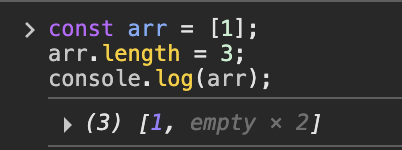

# 26장. ES6 함수의 추가 기능

### ES6 이전의 함수

- ES6 이전의 함수는 일반 함수로서, 생성자 함수로서 호출 가능

  = `callable` 이면서 `constructor` 다.

  -> 하지만, 사용 목적에 따라 구분이 없어 실수를 유발할 수 있고 성능에도 좋지 않다.

### ES6의 함수

| ES6 함수    | constructor | prototype | super | arguments | this 바인딩  |
| ----------- | ----------- | --------- | ----- | --------- | ------------ |
| 일반 함수   | O           | O         | X     | O         | 호출 시 결정 |
| 메서드      | X           | X         | O     | O         | 호출 객체    |
| 화살표 함수 | X           | X         | X     | X         | 외부 상속    |

<br/>

### 메서드

- 메서드 축약 표현으로 정의된 함수만이 메서드다.
- 인스턴스를 생성할 수 없는 `non-constructor`다 -> prototype 프로퍼티 x, 프로토타입 생성 x
- 자신을 바인딩한 객채를 가리키는 내부 슬롯 [[HomeObject]]를 갖는다.

<br/>

### 화살표 함수

> 표현과 내부 동작이 기존의 함수보다 간략하다. <br/>
> 콜백 함수 내부에서 this가 전역 객체를 가리키는 믄제를 해결하기 위한 대안으로 유용하다.

- 함수 선언문으로 정의 x, 함수 표현식으로 정의 o
- 일급 객체이므로, 고차함수에 인수로 전달할 수 있다.
- 함수 몸체 정의
  - 함수 몸체가 하나의 문으로 구성되면, 중괄호 {} 를 생략할 수 있다.
  - 단, 함수 몸체가 표현식이 아닌 문이라면, 중괄호를 생략할 수 없다 -> 표현식이 아닌 문은 반환할 수 없기 때문
  - 객체 리터럴을 반환하는 경우, 객체 리터럴은 소괄호 () 로 감싸주어야 한다.

```js
const multiply = (x, y) => x * y;
multiply(2, 3);
```

### 화살표 함수와 일반 함수의 차이

1. 화살표 함수는 인스턴스를 생성할 수 없는 `non-constructor`다.
2. 중복된 매개변수 이름을 선언할 수 없다.
3. 화살표 함수는 함수 자체의 this, arguments, super, new.target 바인딩을 갖지 않는다.
4. 화살표 함수의 this는 일반 함수와 다르게 동작한다.
   - 콜백 함수 내부의 this가 외부 함수의 this와 다르기 때문에 발생하는 문제를 해결하기 위해 의도적으로 설계된 것이다. -> `콜백 함수 내부의 this 문제`
   - 화살표 함수는 함수 자체의 this 바인딩을 갖지 않는다. 따라서 화살표 함수 내부에서 this를 참조하면 상위 스코프의 this를 그대로 참조한다. 이를 `lexical this`라 한다.
   - 화살표 함수가 중첩되어 있다면, 스코프 체인 상에서 가장 가까운 상위 함수 중에서 화살표 함수가 아닌 함수의 `this`를 참조한다.
   - call, apply, bind 메서드를 호출할 순 있지만, 아무런 일이 일어나지 않는다.
   - 일반적엔 메서드를 정의할 떄는, ES6 메서드 축약 표현으로 정의한 ES6 메서드를 사용하는 것이 좋다.
5. 화살표 함수는 함수 자체의 super 바인딩을 갖지 않는다.
6. 화살표 함수는 함수 자체의 arguments 바인딩을 갖지 않는다.

<br/>

### Rest 파라미터

> 나머지 매개변수, 매개변수 이름 앞에 세개의 점 `...` 을 붙여서 정의한 매개변수

- 함수에 전달된 인수들의 목독을 배열로 전달받는다.
- 먼저 선언된 매개변수에 할당된 인수를 제외한 나머지 인수들로 구성된 배열리 할당된다. -> 반드시 마지막 파라미터여야 한다.
- 단 하나만 선언할 수 있다.
- 함수 정의 시 선언한 매개변수 개수를 나타내는 함수 객체의 length 프로퍼티에 영향을 주지 않는다.
- 화살표 함수는 함수 자체의 arguments 객체를 갖지 않기 때문에, 화살표 함수로 가변 인자 함수를 구현할 때는 반드시 Rest 파라미터를 사용해야 한다.

<br/>

### 매개변수 기본값

인수가 전달되지 않은 매개변수의 값은 `undefined`다.

이를 방치하면 의도치 않은 결과가 나올 수 있기 때문에 방어 코드가 필요하다.

- 매개변수 기본값을 사용하면 함수 내에서 수행하던 인수 체크 및 초기화를 간소화할 수 있다.

<br/>
<br/>

# 27장. 배열

배열은 객체지만, 일반 객체와는 구별되는 특징을 가진다

1. length 프로퍼티 o
2. 값의 순서 o

-> 이러한 특징으로 배열은 순차적으로 or 역순으로 or 특정 위치부터 요소에 접근 가능하다.

### 자바스크립트 배열은 배열이 아니다

> 자바스크립트의 배열은 일반적인 배열의 동작을 흉내 낸 특수한 객체다.

- `자료구조의 배열`
  - 동일한 크기의 메모리 공간이 빈틈없이 연속적으로 나열된 것 = `밀집 배열(dense array)`
- `자바스크립트의 배열`
  - 각각의 메모리 공간은 동일한 크기를 갖지 않아도 되며, 연속적으로 이어져 있지 않을 수 있다. = `희소 배열(sparse array)`
  - 요소는 프로퍼티 값이므로, 어떤 타입의 값이라도 배열의 요소가 될 수 있다.
  - 인덱스로 요소에 접근하는 경우, 일반적인 배열보다 성능적인 면에서 느리다.
  - 특정 요소를 검색하거나, 요소를 삽입 삭제하는 경우에는 2배 정도 빠를 수 있다.

<br/>

### length 프로퍼티와 희소 배열

- 임의의 숫자 값을 명시적으로 할당할 수 있다.

  - 현재 length 프로퍼티 값보다 작은 값을 할당한 경우

    

  - 큰 값을 할당한 경우

    

    `empty x 2`는 실제로 추가된 배열의 요소가 아니며, 실제 배열에는 아무런 변화가 없다.

- 이처럼 배열의 요소가 연속적으로 위치하지 않고 일부가 비어 있는 배열을 `희소 배열`이라고 한다.

- 희소 배열의 length는 희소 배열의 실제 요소 개수보다 언제나 크다.

  

> 희소 배열은 성능에 좋지 않기 때문에 쓰지 않는 것이 좋다. 배열에는 같은 타입의 요소를 연속적으로 위치시키는 것이 최선이다.

<br/>

### 배열 생성

1. 배열 리터럴
2. Array 생성자 함수

   - 전달된 인수에 따라 다르게 동작한다.

   ```js
   const arr1 = new Array(10); // [empty x 10]
   console.log(arr1.length); // 10

   const arr2 = new Array(); // []
   const arr3 = new Array(1, 2, 3); // [1, 2, 3]
   ```

3. `Array.of`

   - 전달된 인수를 요소로 갖는 배열을 생성한다.

4. `Array.from`

   - 유사 배열 객체, 이터러블 객체를 인수로 전달받아 배열로 변환한다.

   ```js
   Array.from({ length: 2, 0: 'a', 1: 'b' }); // ['a', 'b']
   Array.from('Hello'); // ['H', 'e', 'l', 'l', 'o']
   Array.from({ length: 3 }); // [undefined, undefined, undefined]
   Array.from({ length: 3 }, (_, i) => i); // [0, 1, 2]
   ```

<br/>

### 배열 메서드

> 배열을 변경하지 않고 새로운 배열을 생성하는 메서드를 사용하는 것이 좋다.

#### `Array.isArray`

#### `Array.prototype.indexOf`

```js
const arr = [1, 2, 2, 3];

arr.indexOf(2); // 1
arr.indexOf(4); // 존재하지 않으면 -1

arr.indexOf(2, 2); // 두번째 인수는 검색을 시작할 인덱스
```

#### `Array.prototype.push` / `pop`

> push 메서드보다는 스프레드 문법, length 프로퍼티 사용하기

- 인수로 전달 받은 값을 원본 배열의 마지막 요소로 추가하고, 변경된 length 프로퍼티 값을 반환한다.
- 원본 배열을 직접 변경시키기 때문에 성능이 좋지 않다.

```js
const arr = [1, 2];
arr[arr.length] = 3;

const newArr = [...arr, 4]; // [1, 2, 3, 4]
```

#### `Array.prototype.unshift` / `shift`

#### `Array.prototype.concat`

- 인수로 전달된 값을 원본 배열의 마지막 요소로 추가한 새로운 배열을 반환한다.
- `push`, `unshift` 메서드는 concat 메서드로 대체할 수 있다.

```js
const arr1 = [1, 2];
const arr2 = [3, 4];

let result = arr1.concat(arr2); // [1, 2, 3, 4]

result = arr1.concat(3); // [1, 2, 3]
result = arr1.concat(arr2, 5); // [1, 2, 3, 4, 5]

console.log(arr1); // 원본 배열은 변경되지 않음 [1, 2]
```

#### `Array.prototype.splice(start, deleteCount, items)`

- 원본 배열의 중간에 요소를 추가하거나 제거하는 경우 사용
- `start`: 제거를 시작할 인덱스
- `deleteCount`: 제거할 요소의 개수
- `items`: 제거한 위치에 삽입할 요소들

```js
const arr = [1, 2, 3, 4];
const result = arr.splice(1, 2, 20, 30); // [2, 3]

console.log(result); // [2, 3]
console.log(arr); // [1, 20, 30, 4]

const result2 = arr.splice(1, 2);
console.log(result2); // [20, 30]
console.log(arr); // [1, 4]
```

#### `Array.prototype.slice(start, end)`

- 인수로 전달된 범위의 요소들을 복사해서 새로운 배열로 반환한다.
- 유사 배열 객체를 배열로 변환할 수 있다.
- `start`: 복사를 시작할 인덱스
- `end`: 복사를 종료할 인덱스

```js
const arr = [1, 2, 3];

arr.slice(0, 1); // [1]
arr.slice(1, 2); // [2]
arr.slice(-2); // 끝에서부터 2개 복사

const copy = arr.slice(); // [1, 2, 3]
```

#### `Array.prototype.join`

- 기본 구분자는 콤마(,)

#### `Array.prototype.reverse`

- 원본 배열의 순서를 반대로 변경한다.

#### `Array.prototype.fill`

- 인수로 전달받은 값을 처음부터 끝까지 요소로 채운다.
- `첫 번째 인수`: 채울 값
- `두 번째 인수`: 요소 채우기를 시작할 인덱스
- `세 번째 인수`: 요소 채우기를 멈출 인덱스

```js
const sequences = (length = 0) => Array.from({ length }, (_, i) => i);

console.log(sequences(3)); // [0, 1, 2]
```

#### `Array.prototype.includes`

- `첫 번째 인수`: 검색할 대상
- `두 번째 인수`: 검색을 시작할 인덱스

#### `Array.prototype.flat`

- 인수로 전달한 깊이만큼 재귀적으로 배열을 평탄화한다.

```js
[1, [2, 3, 4, 5]].flat(); // [1, 2, 3, 4, 5]

[1, [2, [3, [4]]]].flat(2); // [1, 2, 3, [4]]]
[1, [2, [3, [4]]]].flat().flat(); // [1, 2, 3, [4]]]

[1, [2, [3, [4]]]].flat(Infinity); // [1, 2, 3, 4]
```

<br/>

### 배열 고차 함수 (HOF)

함수를 인수로 전달받거나 함수를 반환하는 함수다.

고차 함수는 불변성을 지향하는 함수형 프로그래밍에 기반을 두고 있다.

- 함수형 프로그래밍은 순수 함수와 보조 함수의 조합을 통해
  - 조건문과 반복문을 제거하여 복잡성을 해결하고
  - 변수의 사용을 억제하여 상태 변경을 피하려는 패러다임이다.

-> 순수 함수를 통해 부수 효과를 최대한 억제하여 오류를 피하고 프로그램의 안정성을 높이려는 노력

#### `Array.prototype.sort`

- 배열의 요소를 일시적으로 문자열로 변환한 후 유니코드 코드 포인트의 순서를 기준으로 정렬한다.
- 문자열로 이루어진 배열의 정렬은 괜찮지만,
- 숫자로 이루어진 배열을 정렬할 때는 주의해야 한다.

  - 숫자는 정렬 순서를 정의하는 비교 함수를 인수로 전달해야 한다.

```js
const points = [40, 100, 1, 5, 2, 25, 10];

points.sort((a, b) => a - b);
```

#### `Array.prototype.forEach`

- 반복문을 추상화한 고차 함수
- 내부에서 반복문을 통해 자신을 호출한 배열을 순회하면서 수행해야 할 처리를 콜백 함수로 전달받아 반복 호출한다.
- 두번째 인수로 콜백 함수 내부에서 this로 사용할 객체를 전달할 수 있다.

```js
const numbers = [1, 2, 3];
const pows = [];

numbers.forEach((item) => pows.push(item ** 2));
console.log(pows); // [1, 4, 9]

[1, 2, 3].forEach((item, index, arr) => {
  console.log(`요소값: ${item}, 인덱스: ${index}, this: ${JSON.stringfy(arr)}`);
});
/*
요소값: 1, 인덱스: 0, this: [1, 2, 3]
요소값: 2, 인덱스: 1, this: [1, 2, 3]
요소값: 3, 인덱스: 2, this: [1, 2, 3]
*/
```

#### `Array.prototype.map`

- 자신을 호출한 배열의 모든 요소를 순회하면서 인수로 전달받은 콜백 함수를 반복 호출한다.
- **콜백 함수의 반환값들로 구성된 `새로운 배열`을 반환한다.**
  - 새로운 배열의 length 프로퍼티 값은 map 메서드를 호출한 배열의 legnth 프로퍼티 값과 반드시 일치한다.
  - 즉, map 메서드를 호출한 배열과 map 메서드가 생성해서 반환한 배열은 1:1 매핑한다.

#### `Array.prototype.filter`

- 자신을 호출한 배열의 모든 요소를 순회하면서 인수로 전달받은 콜백 함수를 반복 호출한다.
- **콜백 함수의 반환값이 true인 요소로만 구성된 `새로운 배열`을 반환한다.**
- 자신을 호출한 배열에서 특정 요소를 제거하기 위해 사용할 수도 있다.
  - 특정 요소가 중복되어 있다면, 중복된 요소가 모두 제거된다.
  - 특정 요소를 하나만 제거하려면, `indexOf` 메서드를 통해 그 요소의 인덱스를 얻은 다음 `splice` 메서드를 사용한다.

#### `Array.prototype.reduce`

- 자신을 호출한 배열의 모든 요소를 순회하면서 인수로 전달받은 콜백 함수를 반복 호출한다.
- **콜백 함수의 반환값을 다음 순회 시에 콜백 함수의 첫 번째 인수로 전달하면서 콜백 함수를 호출하여, `하나의 결과값`을 만들어 반환한다.**
- 언제나 초기값을 전달하는 것이 안전하다.

```js
// 평균 구하기
const value = [1, 2, 3, 4, 5, 6];

const average = values.reduce((acc, cur, i, { length }) => {
  return i === lenght - 1 ? (acc + cur) / length : acc + cur;
}, 0);
```

#### `Array.prototype.some`

- 자신을 호출한 배열의 모든 요소를 순회하면서 인수로 전달된 콜백 함수를 호출한다.
- **배열의 요소 중에 콜백 함수를 통해 정의한 조건을 만족하는 요소가 1개 이상 존재하는지 확인하여 그 결과를 `불리언 타입`으로 반환한다.**
- 단, 빈 배열인 경우 항상 `false`를 반환한다.

```js
[5, 10, 15].some(item => item > 10) //  true
[].some(item => item > 3) // false
```

#### `Array.prototype.every`

- 자신을 호출한 배열의 모든 요소를 순회하면서 인수로 전달된 콜백 함수를 호출한다.
- **배열의 모든 요소가 콜백 함수를 통해 정의한 조건을 모두 만족하는지 확인하여 그 결과를 `불리언 타입`으로 반환한다.**
- 단, 빈 배열인 경우 항상 `true`를 반환한다.

```js
[5, 10, 15].every(item => item > 3) //  true
[].every(item => item > 3) // true
```

#### `Array.prototype.find`

- 자신을 호출한 배열의 모든 요소를 순회하면서 인수로 전달된 콜백 함수를 호출한다.
- **반환값이 true인 `첫 번째 요소`를 반환한다. 존재하지 않는다면 `undefined`를 반환한다.**
- `filter` 함수는 배열을 반환하지만, `find` 함수는 배열이 아닌 해당 요소값이다.

#### `Array.prototype.findIndex`

- 자신을 호출한 배열의 모든 요소를 순회하면서 인수로 전달된 콜백 함수를 호출한다.
- **반환값이 true인 `첫 번째 요소의 인덱스`를 반환한다. 존재하지 않는다면 `-1`을 반환한다.**

#### `Array.prototype.flatMap`

- `map` 메서드를 통해 생성된 새로운 배열을 평탄화한다.
- `map` 메서드와 `flat` 메서드를 순차적으로 실행하는 효과가 있다.
- 단, 평탄화 깊이를 지정할 수 없고 1단계만 평탄화한다.

<br/>
<br/>

# 28장. Number

표준 빌트인 객체인 Number는 생성자 함수 객체다.

### Number 생성자 함수

```js
let numObj = new Number(10); // Number {[[PrimitiveValue]] : 10}

numObj = new Number('10'); // Number {[[PrimitiveValue]] : 10}
numObj = new Number('Hello'); // Number {[[PrimitiveValue]] : NaN}
```

### Number 프로퍼티

### Number 메서드

#### `Number.isFinite`

- 인수가 정상적인 유한수이면 `true`
- 인수가 무한수이면 `false`

```js
Number.isFinite(null); // 인수를 숫자로 암묵적 타입 변환하지 않는다. false
isFinite(null); // 인수를 숫자로 암묵적 타입 변환한다. true
```

#### `Number.isInteger`

- 인수가 정수이면 `true`
- 인수가 정수가 아니면 `false`

#### `Number.isNaN`

- 인수가 NaN이면 `true`

```js
Number.isNaN(undefined); // 인수를 숫자로 암묵적 타입 변환하지 않는다. false
isNaN(undefined); // 인수를 숫자로 암묵적 타입 변환한다. true
```

#### `Number.isSafeInteger`

#### `Number.prototype.toExponential`

#### `Number.prototype.toFixed`

- 숫자를 반올림해서 문자열로 반환한다.
- 인수를 생략하면 기본값 0이 지정된다.

```js
(12345.6789).toFixed(); // 12346
(12345.6789).toFixed(1); // 12345.7
(12345.6789).toFixed(2); // 12345.68
```

#### `Number.prototype.toPrecision`

#### `Number.prototype.toString`

- 숫자를 문자열로 변환한다.
- 인수를 생략하면 기본값 10진법이 지정된다.

```js
(10).toString(); // '10'
(16).toString(2); // '10000'
(16).toString(8); // '20'
(16).toString(16); // '10'
```

<br/>
<br/>

# 29장. Math

표준 빌트인 객체인 Math는 생성자 함수가 아니다. 정적 프로퍼티와 정적 메서드만 제공한다.

### Math 프로퍼티

#### `Math.PI`

### Math 메서드

#### `Math.abs`

#### `Math.round`

- 소수점 이하를 반올림한 정수 반환

#### `Math.ceil`

- 소수점 이하를 올림한 정수 반환

#### `Math.floor`

- 소수점 이하를 내림한 정수 반환

#### `Math.sqrt`

#### `Math.random`

- 난수를 반환
- 0~1 미만의 실수다.

```js
const random = Math.floor(Math.random() * 10 + 1); // 1 ~ 10
```

#### `Math.pow`

#### `Math.max`

- 배열을 인수로 전달받으면, apply 메서드나 스프레드 문법을 사용해야 한다.

```js
Math.max.apply(null, [1, 2, 3]); // 3
Math.max(...[1, 2, 3]); // 3
```

#### `Math.min`

<br/>
<br/>

# 30장. Date

표준 빌트인 객체 Date는 날짜와 시간을 위한 빌트인 객체이면서 생성자 함수다.

UTC는 국제 표준시며, KST(한국표준시)는 UTC에 9시간을 더한 시간이다.

### Date 생성자 함수

1. `new Date()`

2. `new Date(milliseconds)`

3. `new Date(dateString)`

4. `new Date(year, month[,day, hour, minute, second, millisecond])`

```js
new Date(); // Wed Apr 02 2025 17:47:26 GMT+0900 (한국 표준시) {}

new Date(86400000); // 하루 지난 Date 반환
new Date('2020/03/26/10:00:00');
new Date(2020, 2); // 2020년 3월 1일 Date 반환
```

<br/>

### Date 메서드

```jsx
const today = new Date();

today.setFullYear(2000);
today.getFullYear(); // 2000

today.setMonth(0); // 1월
today.getMonth(); // 0

new Date('2020/07/24').getMonth(); // 6

const date = new Date('2020/7/24/12:30');
date.toISOString(); // 2020-07-24T03:30:00.000Z
date.toISOString().slice(0, 10); // 2020-07-24

date.toLocatleString(); // 2020. 7. 24. 오후 12:30:00
```

<br/>

### Example. 시계

```js
(function printNow() {
  const today = new Date();

  const dayNames = [
    '(일요일)',
    '(월요일)',
    '(화요일)',
    '(수요일)',
    '(목요일)',
    '(금요일)',
    '(토요일)',
  ];

  const day = dayNames[today.getDay()];

  const year = today.getFullYear();
  const month = today.getMonth() + 1;
  const date = today.getDate();
  let hour = today.getHours();
  let minute = today.getMinutes();
  let second = today.getSeconds();

  const ampm = hour >= 12 ? 'PM' : 'AM';

  // 12시간제로 변경
  hour %= 12;
  hour = hour || 12; // hour 0인 경우 12를 재할당

  // 10 미만인 분,초 2자리로 변경
  minute = minute < 10 ? '0' + minute : minute;
  second = second < 10 ? '0' + second : second;

  const now = `${year}년 ${month}월 ${date}일 ${day} ${hour}:${minute}:${second} ${ampm}`;

  console.log(now);

  setTimeout(printNow, 1000); // 1초마다 타이머 함수 재귀호출
})();
```
